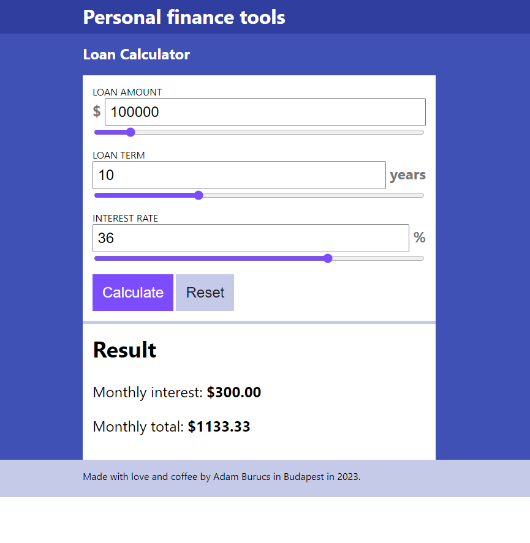

# Loan Calculator

You can calculate simple loans with this tool.

## Features

- Vanilla JavaScript
- Fully responsive
- CSS Nesting
- Color palette from Material Palette

## Minimum Requirements

- Node.js v18.13.0
- npm 8.19.3

## Usage

1. Install packages: `npm i`
1. Run development environment: `npm run dev`
1. Open browser at http://localhost:5173/

## Build

Execute: `npm run build`

## License

Please see the [LICENSE file](./LICENSE).
